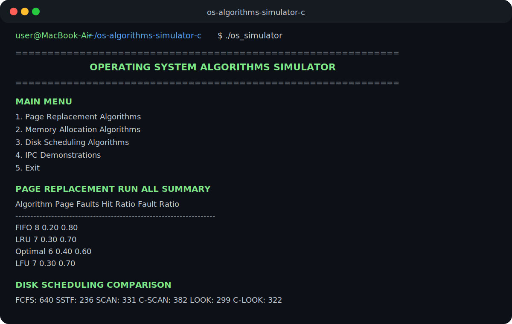

# Operating System Algorithms Simulator in C

A menu-driven C application that simulates important Operating System algorithms through an interactive command-line interface. The project demonstrates core OS concepts such as page replacement, memory allocation, disk scheduling, and inter-process communication.

This repository is suitable as a systems programming / operating systems portfolio project because it combines algorithm implementation, modular C structure, user input handling, algorithm comparison, and Unix/Linux process concepts.

---

## Sample Output



---

## Project Overview

Operating systems use different algorithms to manage memory, storage access, and process communication. This project provides a practical simulator for those concepts so users can enter inputs, run algorithms, and compare the results directly from the terminal.

The program currently includes:

- Page replacement algorithms
- Memory allocation algorithms
- Disk scheduling algorithms
- Inter-process communication demonstrations
- Algorithm complexity documentation
- Final comparison tables after Run All modes

---

## Key Features

### Page Replacement Algorithms

- FIFO: First In, First Out
- LRU: Least Recently Used
- Optimal Page Replacement
- LFU: Least Frequently Used
- Run all page replacement algorithms for comparison
- User-defined page reference string
- User-defined number of frames
- Page fault count
- Page hit ratio and page fault ratio
- Final comparison table for FIFO, LRU, Optimal, and LFU

### Memory Allocation Algorithms

- First Fit
- Best Fit
- Worst Fit
- Run all memory allocation algorithms for comparison
- User-defined memory block sizes
- User-defined process sizes
- Allocation summary
- Internal and external fragmentation-style reporting

### Disk Scheduling Algorithms

- FCFS: First Come, First Serve
- SSTF: Shortest Seek Time First
- SCAN: Elevator Algorithm
- C-SCAN: Circular SCAN
- LOOK
- C-LOOK
- Run all disk scheduling algorithms for comparison
- User-defined request queue
- User-defined initial head position
- Direction selection for SCAN, C-SCAN, LOOK, and C-LOOK
- Total and average seek time calculation
- Final comparison table for all disk scheduling algorithms

### Inter-Process Communication

- Pipe communication
- Producer-consumer problem using semaphores
- Shared memory writer
- Shared memory reader

---

## Technologies Used

- C Programming
- GCC Compiler
- POSIX Threads
- Semaphores
- Shared Memory
- Pipes
- Unix/Linux system calls
- Command-line interface design

---

## Project Structure

```text
.
├── include/
│   ├── algorithm_reports.h
│   ├── diskscheduling.h
│   ├── ipc.h
│   ├── memoryallocation.h
│   └── pagereplacement.h
├── screenshots/
│   └── sample-output.svg
├── main.c
├── Makefile
├── README.md
├── UPGRADE_PLAN.md
├── ALGORITHM_COMPLEXITY.md
└── .gitignore
```

---

## How to Compile

Using GCC:

```bash
gcc -Wall -Wextra -std=c11 main.c -o os_simulator -pthread
```

If using the included Makefile:

```bash
make
```

---

## How to Run

```bash
./os_simulator
```

---

## Main Menu

```text
OPERATING SYSTEM ALGORITHMS SIMULATOR

1. Page Replacement Algorithms
2. Memory Allocation Algorithms
3. Disk Scheduling Algorithms
4. IPC (Inter-Process Communication)
5. Exit
```

---

## Sample Demo Flow

### Page Replacement Example

```text
Frames: 3
Page reference string: 7 0 1 2 0 3 0 4 2 3
Algorithms: FIFO, LRU, Optimal, LFU
```

Expected learning outcome:

- Understand how page faults occur
- Compare FIFO, LRU, Optimal, and LFU behaviour
- Observe how limited frames affect memory performance
- Compare page hit ratio and page fault ratio
- Use the Run All comparison table to compare algorithms directly

### Memory Allocation Example

```text
Memory blocks: 100 500 200 300 600
Processes: 212 417 112 426
Algorithms: First Fit, Best Fit, Worst Fit
```

Expected learning outcome:

- Compare how different allocation strategies place processes
- Observe fragmentation behaviour conceptually
- Understand why allocation strategy affects memory utilisation

### Disk Scheduling Example

```text
Requests: 98 183 37 122 14 124 65 67
Initial head: 53
Algorithms: FCFS, SSTF, SCAN, C-SCAN, LOOK, C-LOOK
```

Expected learning outcome:

- Compare total head movement
- Understand why scheduling strategy affects disk access efficiency
- Observe the difference between SCAN/C-SCAN and LOOK/C-LOOK
- Compare total and average seek times using the final comparison table

---

## Example Comparison Tables

### Page Replacement Run All Summary

```text
Algorithm   Page Faults   Hit Ratio   Fault Ratio
FIFO        8             0.20        0.80
LRU         7             0.30        0.70
Optimal     6             0.40        0.60
LFU         7             0.30        0.70
```

### Disk Scheduling Run All Summary

```text
Algorithm   Total Seek Time   Average Seek Time
FCFS        640               80.00
SSTF        236               29.50
SCAN        331               41.38
C-SCAN      382               47.75
LOOK        299               37.38
C-LOOK      322               40.25
```

---

## Concepts Demonstrated

| Concept | Where It Is Demonstrated |
|---|---|
| Page faults | FIFO, LRU, Optimal, and LFU modules |
| Page hit/fault ratio | Page replacement summary output |
| Memory allocation | First Fit, Best Fit, Worst Fit |
| Disk head movement | FCFS, SSTF, SCAN, C-SCAN, LOOK, C-LOOK |
| Algorithm comparison | `algorithm_reports.h` comparison tables |
| Process communication | Pipes and shared memory |
| Synchronisation | Producer-consumer with semaphores |
| Algorithm complexity | `ALGORITHM_COMPLEXITY.md` |
| Modular C design | Header-based algorithm separation |
| CLI interaction | Menu-driven program flow |

---

## Complexity Reference

A separate complexity reference has been added:

```text
ALGORITHM_COMPLEXITY.md
```

It summarises time and space complexity for page replacement, memory allocation, disk scheduling, and IPC demonstrations.

---

## Why This Project Is Useful

This project helps demonstrate practical understanding of Operating System concepts that are usually studied theoretically. Instead of only learning definitions, users can enter custom inputs and observe how different algorithms behave.

It is useful for:

- Operating Systems coursework
- Algorithm visualisation through terminal output
- C programming practice
- Unix/Linux systems programming practice
- Technical portfolio demonstration

---

## Future Enhancements

- Add graphical visualisation for page replacement and disk scheduling.
- Add automated test cases for each module.
- Add CSV export for algorithm results.
- Add a web-based dashboard version.
- Split header implementations into separate `.c` source files.

---

## Resume Summary

Built a modular Operating System Algorithms Simulator in C implementing FIFO, LRU, Optimal, LFU, First Fit, Best Fit, Worst Fit, FCFS, SSTF, SCAN, C-SCAN, LOOK, C-LOOK, algorithm comparison tables, and IPC concepts using GCC, POSIX threads, semaphores, shared memory, pipes, and a menu-driven terminal interface.
